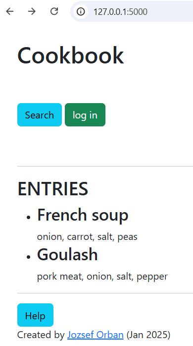

# CookBook - a (local) web app on Flask

Flask is a Python module that this Cookbook app uses.

Flask is a lightweight WSGI (Web Server Gateway Interface) web application framework. It is designed to make getting started quick and easy, with the ability to scale up to complex applications. It began as a simple wrapper around Werkzeug and Jinja, and has become one of the most popular Python web application frameworks.

Also, if you're completely new to Flask and/or web development in general, it's important to grasp these basic fundamental concepts:

1. The app handles HTTP GET and POST requests which are base of the functionality.
1. HTML pages are rendered and/or returned to the end user with predefined and dynamic (SQL database dependent) content.

## The app

Note: See Help page (help.html reachable through a link at the bottom of the Start page (index.html)) as general and first run help including functionalities and usage of the app, in addition to this readme.

It is planned to function as a searchable Cookbook, with dish names and corresponding text (ingredients, cooking description,...).




## Changelog

The initial app was copied (9th...) and upgraded in Jan, 2025:
- **12/01/2025**: Further explanatory information in code (e.g. functionality of Flash messages). Corrected help.html removing note about Editing (under development) and way of deleting database entries (may be developed the method to become user friendly). Double checked login/logout functionality.
- **10/01/2025**: Added explanatory information in code. Set HTML5 compatibility for html pages. Removed useless files and dependencies (useless for my app).
- **09/01/2025**: Added Help page as general and first run help including functionalities and usage of the app. Reorganized models.py to match Model structure requirement of web application development (... and related refactorization)


## Contents

## Requirements

This tutorial utilizes the following requirements:

1. Python v3.12.0+
1. Flask v3.0.0
1. Flask-SQLAlchemy v3.1.1
1. Flask-WTF 1.2.2

## Download Python

Before beginning make sure you have the latest version of [Python 3.12](https://www.python.org/downloads/release/python-3120/) installed, which you can download from [http://www.python.org/download/](http://www.python.org/download/).

> This app uses Python v3.12.0+.

Along with Python, the following tools are also installed:

- [pip](https://pip.pypa.io/en/stable/) - a [package management](http://en.wikipedia.org/wiki/Package_management_system) system for Python, similar to gem or npm for Ruby and Node, respectively.
- [venv](https://docs.python.org/3/library/venv.html) - used to create isolated environments for development. This is standard practice. Always, always, ALWAYS utilize virtual environments. If you don't, you'll eventually run into problems with dependency conflicts.

## Project Setup

Create a new directory to store the project:

```sh
$ mkdir flask-cookbook
$ cd flask-cookbook
```

Create and activate a virtual environment named *envcb* (for Windows and for Anaconda it may differ slightly):

```sh
$ python -m venv envcb
$ source envcb/bin/activate
(envcb)$
```

> You know that you're in a virtual environment when `envcb` is displayed before the `$` in your terminal: `(env)$`. To exit the virtual environment, use the command `deactivate`. You can reactivate by navigating back to the project directory and running `source env/bin/activate`.

Install Flask with pip or use conda:

```sh
(envcb)$ pip install flask==3.0.0
```

or

```sh
(envcb)$ conda install anaconda::flask
```

## First Test, Hello World
How to start with a simple "hello, world" app, see [Michael Herman's tutorial](https://github.com/realpython/discover-flask).
But basically this is enough:

```
# save this as app.py
from flask import Flask

app = Flask(__name__)

@app.route("/")
def hello():
    return "Hello, World!"
```

Run the app(.py) and the terminal will indicate to open the basic local web port to open:
http://127.0.0.1:5000

Copy this URL and paste in a browser and open the link. 


Dowloading or Git clone-ing this repository will result in the following files and folders:

```sh
├── project
│   ├── __init__.py
│   ├── app.py
│   ├── flaskr.db
│   ├── requirements.txt
│   ├── static
│	│   ├── main.js
│	│   ├── style.css
│   ├── templates
│	│   ├── index.html
│	│   ├── login.html
│	│   ├── search.html
│	│   ├── help.html
│   ├── models
│	│   ├── models.py
```

## First Test, Hello World
Navigate to the Cookbook project folder and run the software from an IDE or run in console by
```sh
(envcb)$ python app.py
```


Then, navigate to [http://localhost:5001/](http://localhost:5001/) in your browser of choice.
You should see 


If you would like to stop the app return to the terminal, kill the local server with 'Ctrl+C'.


## Database by SQLite

Essentially, we use a simple SQLite database and connection. In the models folder the models.py is responsible for setting up the database.

This sets up a single table with three fields: "id", "title", and "text". SQLite will be used for our RDMS since it's part of the standard Python library and requires no configuration.


### Original source

1. Michael Herman's [flaskr-tdd](https://github.com/mjhea0/flaskr-tdd).
1. See further Flask applications at the footnotes of his Readme!
